# T4A2
## Full Stack Application

### Table of Contents

R1 - [Description of your website, including:](#r1-description-of-your-website)
            - [Purpose](#purpose)
            - [Functionality / features](#functionality)
            - [Target audience](#target-audience)
            - [Tech stack](#tech-stack)
R2 - [Dataflow Diagram](#r2-dataflow-diagram)
R3 - [Application Architecture Diagram](#r3-application-architecture-diagram)
R4 - [User Stories](#r4-user-stories)
R5 - [Wireframes](#r5-wireframes)
R6 - [Screenshots of your Trello board throughout the duration of the project](#r6-trello-board)

### R1: Description of your website

#### Purpose

The purpose of the **Record Collector** website is to manage personal vinyl record collections. As collections get larger it can be tedious to keep track of everything, particularly if a collection is stored in a particular order.

#### Functionality

1. Responsive website.
2. Single page application.
3. Simple registration and log in.
4. Display of vinyl records with information such as album name, artist name and year.
5. Change sort order to suit user preferences
6. Ability for users to view, add, edit and remove records.
7. Album art retrieved from external api (MusicBrainz)

#### Target Audience

The primary user of this website is an avid vinyl collector that wishes to keep track of their ever expanding vinyl collection. 

#### Tech Stack

**Frontend: ** HTML, CSS, JavaScript, ReactJS

**Backend: ** Django, PostgreSQL

**Hosting: ** AWS

### R2: Dataflow Diagram

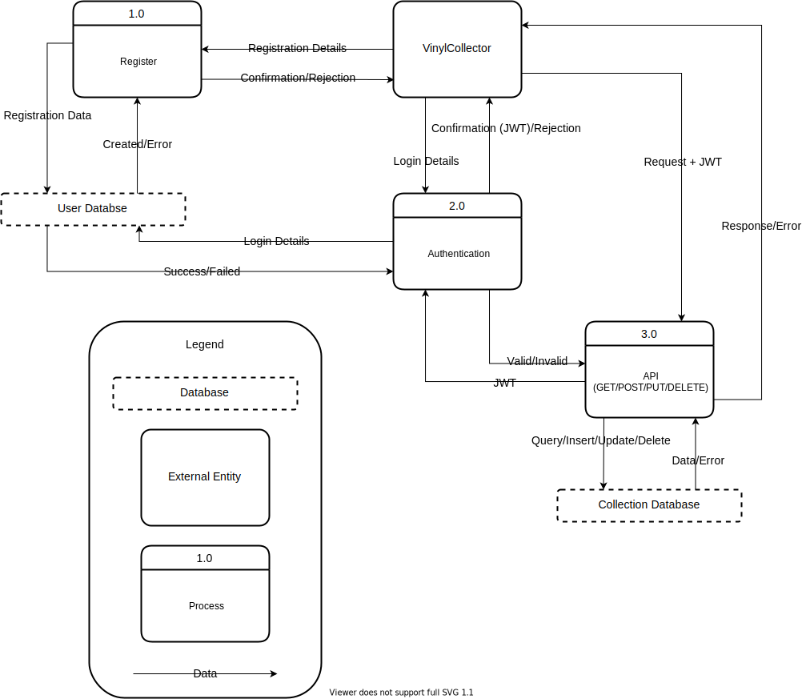

### R3: Application Architecture Diagram

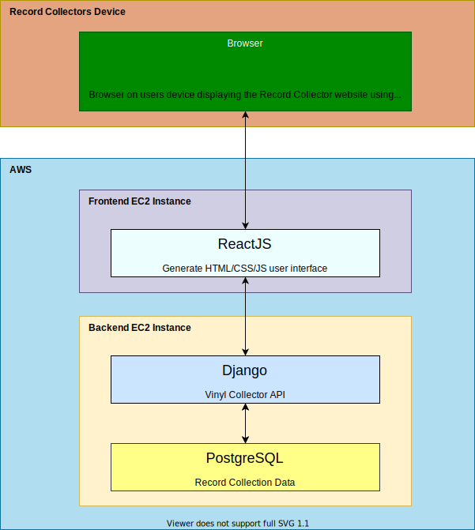

### R4: User Stories

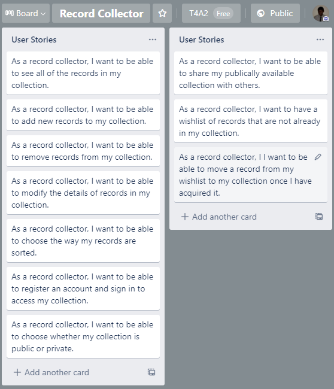

### R5: Wireframes

Desktop - Home Page
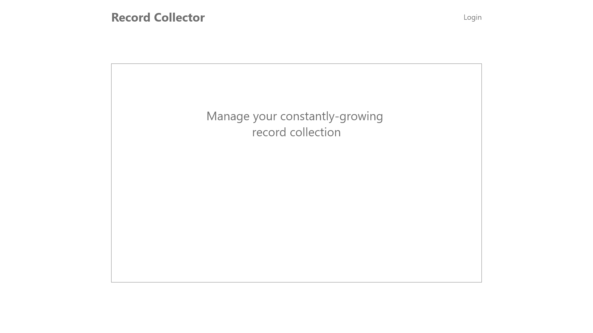

Desktop - Home Page: Signed In
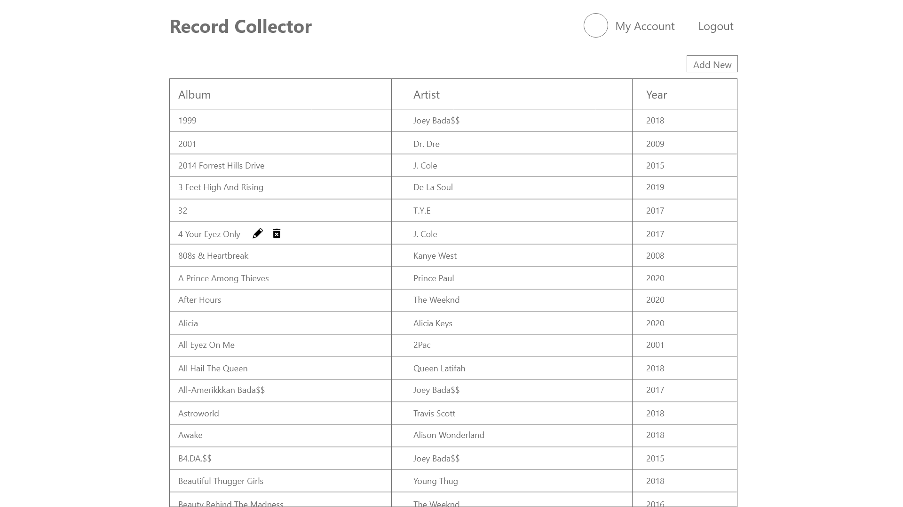

Mobile - Home Page
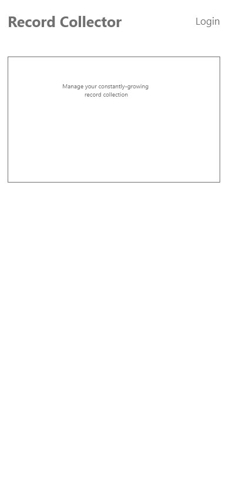

Mobile - Home Page: Signed In
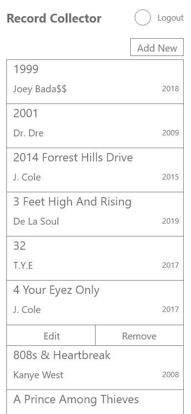

### R6: Trello Board

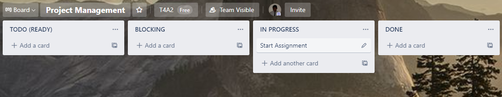

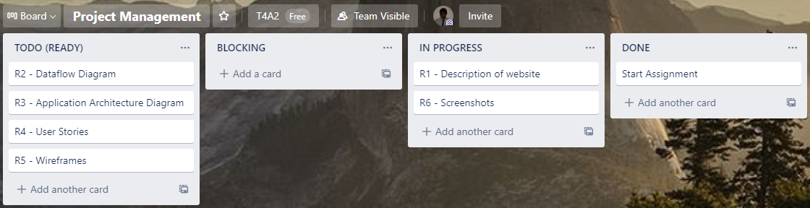

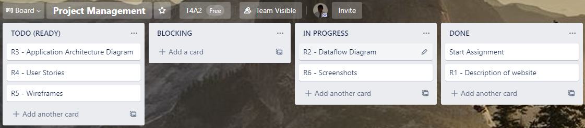

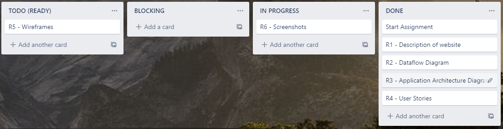

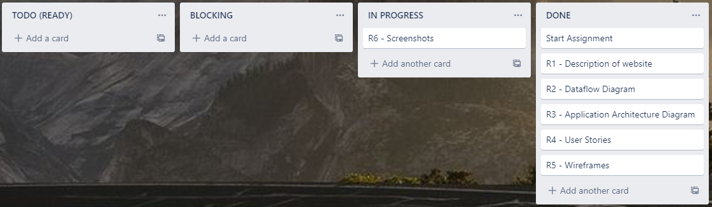

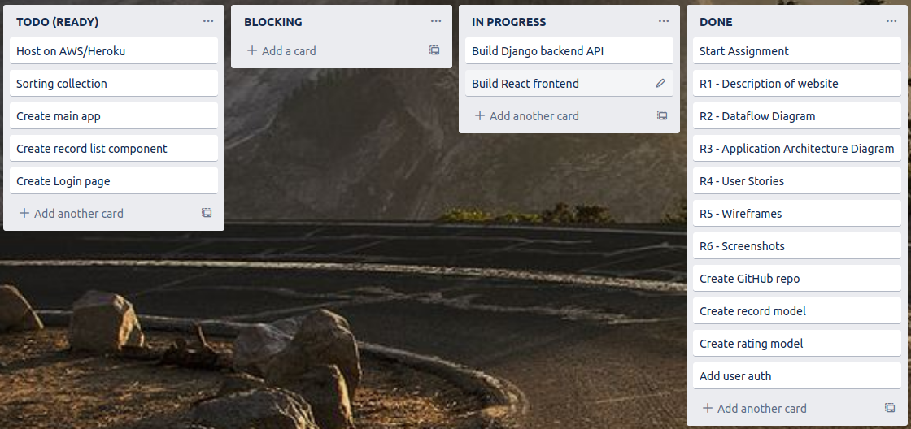

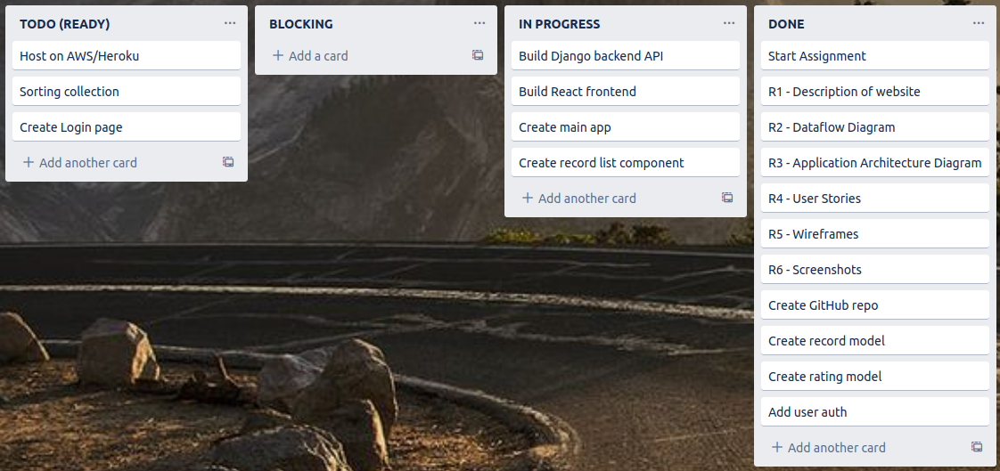

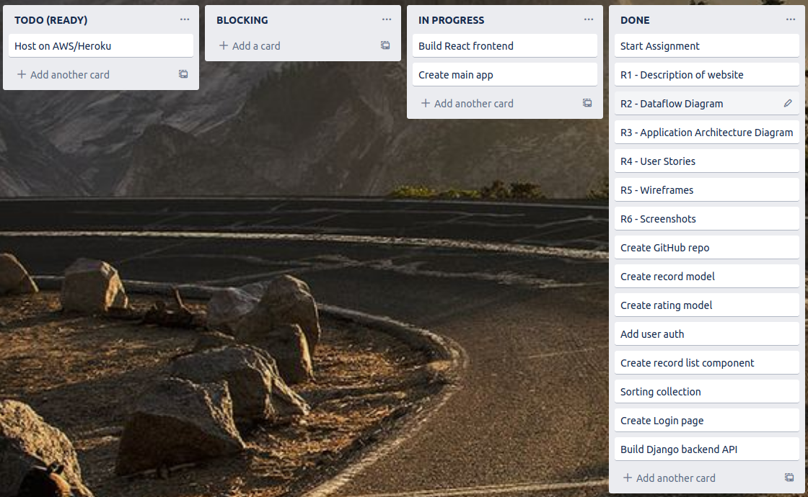

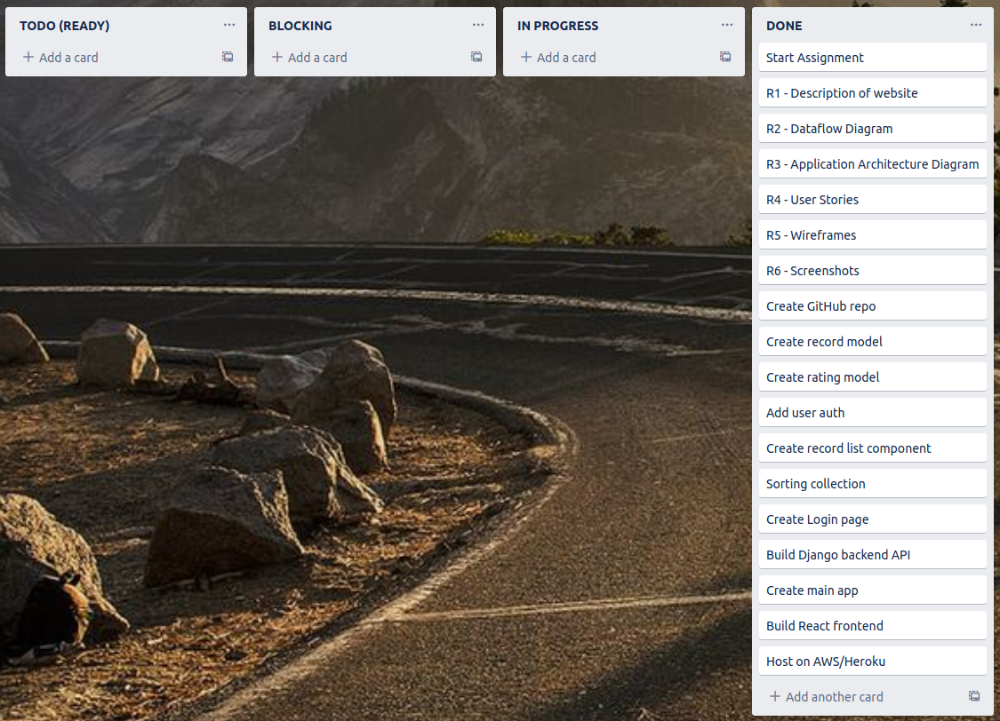